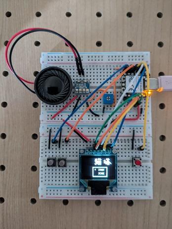

# 🕹 Mini Game Console with Seeed Studio XIAO RA4M1

  
  
  
  

## 🛠 How to Build
For step-by-step instructions, check out this article:
📖 [How to Make a Mini Game Console with XIAO RA4M1](https://zenn.dev/nyannkov/articles/xiao-ra4m1-make-a-mini-game-console)

## License
This sample is released under the MIT License. See the LICENSE file for details.

Please note: source code generated by `mgc_generate.py` (including libs, hw, tilesets, maps, fonts, etc.) is subject to the license of the original source data.
